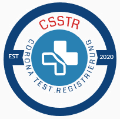

# Corona Self-Service Test Registration (CSSTR)
Register your COVID-19 drive-through test on-the-go and increase the throughput of the testing location.
This project has been developed by [Tobias Müller](https://www.linkedin.com/in/tobias-m%C3%BCller-483790176/), [Stephan Fahrenkrog-Petersen](https://www.linkedin.com/in/stephan-fahrenkrog-petersen-8a2644157/) , and [Julian Theis](https://www.linkedin.com/in/julian-theis/) as part of the [#WirVsVirus Hackathon](https://wirvsvirushackathon.org/) of the German federal government to fight against the coronavirus epidemic.

This project is available as open source code; you can redistribute it and/or modify it under the terms of the GNU General Public License as published by the Free Software Foundation; either version 3 of the License, or (at your option) any later version.
This code is distributed in the hope that it will be useful, but WITHOUT ANY WARRANTY; without even the implied warranty of MERCHANTABILITY or FITNESS FOR A PARTICULAR PURPOSE. See the GNU General Public License for more details.
You should have received a copy of the GNU General Public License along with this it. If not, see [http://www.gnu.org/licenses/gpl-3.0.html](http://www.gnu.org/licenses/gpl-3.0.html).

## Description (German)
Challenge: Corona-Testprozesse: Wie optimieren wir Corona Testprozesse? (Kategorie: 020_Corona_Testprozesse)

Titel: Überwinden des "Testing Bottlenecks" (ID: 1353)

### Problem
Aktuell werden Bürgerinnen und Bürger von Haus- und Fachärzten an Corona-Untersuchungszentren (CUZ) in vielen Kreisen und Städten Deutschlands überwiesen. Die Patienten werden an den CUZ registriert und getestet. In den aktuellen Betrieben fällt auf, dass ein Bottleneck durch eine zeitaufwendige, manuelle und papierbasierte Registrierung der zu testenden Personen entsteht. Dies führt zu langen Wartezeiten und potentiellen Kapazitätsengpässen.

### Ziel
Schnellstmögliche Überwindung des Bottlenecks in den Corona Untersuchungszentren, da neben den Fallzahlen auch die Wartezeiten im CUZ exponentiell steigen. Höhere Kapazitäten bei gleicher Zeit, schnellere Tests, Reduzierung von Human-Error, Stammdatenkonsistenz, und niedrigere Prozesskosten je Test sind somit die Ziele.

### Lösungsansatz
Entwicklung eines digitalen Service zur Selbst-Registrierung zu testendener Personen nach dem "Order-on-the-go"-Prinzip. Einfach zu bedienende Oberfläche zum digitalen Check-In für Personen, die sich dem Coronavirus Test unterziehen - sowohl mobil als auch via Desktop. Die Oberfläche für CUZ Mitarbeiter dient zum Datenabgleich, automatischen Labeldruck und zur Einsicht von Statistiken.

### Entwicklung
Die Webapplikation wurde mittels Django und SQLite entwickelt und ist betriebsbereit. Eine Testphase des CSSTR ist für die kommende Woche in einem CUZ in NRW geplant, in der Hoffnung, dass ein schnelles Rollout deutschlandweit realisiert werden kann. Weitere Integration von Schnittstellen sind geplant, vorallem in Absprache mit potentiellen Projektpartnern.

### Stakeholder
Patienten, Katastrophenschutz, Kreise und kreisfreie Städte, Kommunen, Feuerwehr, Hilfsorganisationen
